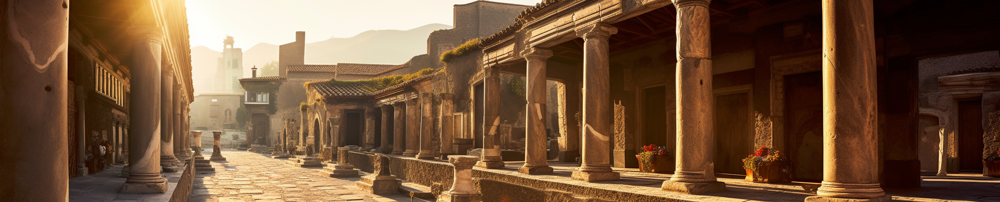
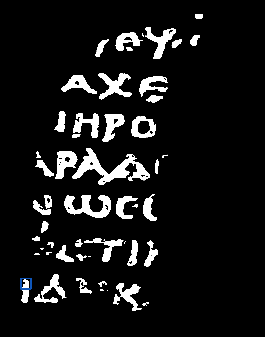
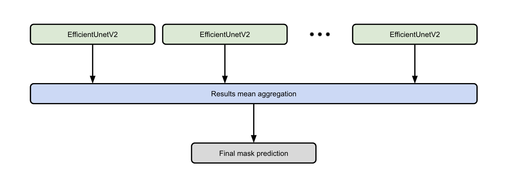

# 🏛️ Vesuvius Challenge - Ink Detection

## 📜 Project Description

This exciting competition, available on Kaggle and supported by the Vesuvius Challenge organization, aims to bring back to life an ancient library buried under the ashes of a volcano. In this competition, our mission was to detect ink from 3D X-ray scanners. Thousands of scrolls were part of a library located in a Roman villa in Herculaneum. This villa was buried by the eruption of Mount Vesuvius nearly 2000 years ago. The scrolls were charred by the heat of the volcano and are now impossible to open without damaging them.

## 📷 Tilling Method

In order to process the ultra-high definition images effectively, we employed an image tiling method. The images were divided into smaller sub-images with a size of 256 by 256 pixels to feed into the model. This approach allowed us to handle the large dataset more efficiently. Additionally, we implemented a selection criterion where we only considered tiles that contained a minimum of 5% ink pixels. By focusing on these specific tiles, we were able to concentrate our efforts on the areas most likely to contain valuable information within the ancient scrolls.

## 🤖 Model architecture

## Contributors

Louis REBERGA   

Baptiste URGELL    

Johan MONCOUTIÉ   

